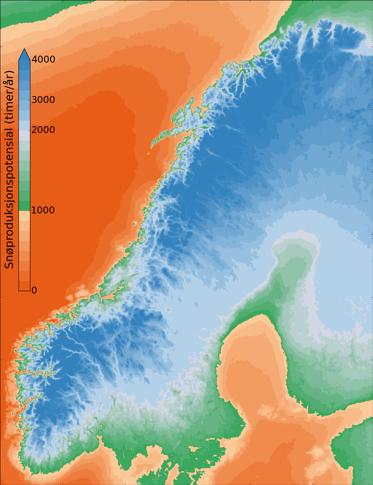

Snow production potential
=========================

This program computes the number of hours per year that snow can be produced in Norway. See run.py
for more information.

Creating data files
-------------------
Use the "compute" command to produce NetCDF files with number of hours:

.. code-block:: bash

   python run.py compute --help

Creating maps
-------------
Use the "plot" command to create images

.. code-block:: bash

   python run.py plot --help

Example output
--------------
Here is an example map for a wetbulb temperature threshold of -3 degrees Celcius:

Copyright and license
---------------------
Copyright (C) 2017 MET Norway. Gridded post-processor is licensed under `GPL
version 2 <https://github.com/tnipen/snowproduction/blob/master/LICENSE>`_ or (at
your option) any later version.
